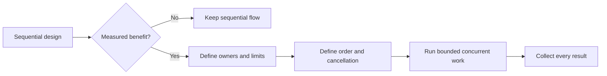

# P080 — Make Concurrency Deliberate

## Definition

**Make Concurrency Deliberate** permits parallel or asynchronous execution only for a demonstrated
requirement. The design defines the full coordination model. The model specifies shared state,
synchronization, order, cancellation, deadlines, error collection, and capacity limits.

**Aliases:** none in common use.

## Provenance

**Classification:** established principle.

No single source established this wording. The rule reflects work on processes, synchronization,
messages, structured concurrency, and language memory models. This work shows that concurrency
changes the correctness model and needs explicit analysis.

## Decision rule

Use sequential execution by default. Use concurrency only for a concrete latency, throughput,
response, or isolation benefit. Select a model with testable safety and termination properties.

## How to apply

- Name the expected benefit and measure whether it is material.
- Minimize shared mutable state. Prefer immutable messages or ownership transfer.
- Specify ordering guarantees, synchronization, and permitted interleavings.
- Bound workers, queues, fan-out, and outstanding work.
- Propagate deadlines and cancellation through the task tree.
- Define how partial failures and multiple concurrent errors combine.
- Use race detection, stress tests, and deterministic model tests where appropriate.

## Diagram

The design adds concurrency only after it identifies a measured benefit.



## Language examples

The two examples await two operations, preserve input order, return each result, and cancel unfinished
work with the caller.

### Python

```python
FetchResult = bytes | BaseException

async def fetch_pair(urls: tuple[str, str]) -> tuple[FetchResult, FetchResult]:
    results = await asyncio.gather(
        fetch(urls[0]), fetch(urls[1]), return_exceptions=True
    )
    return results[0], results[1]
```

### Rust

```rust
type FetchResult = Result<Body, Error>;

async fn fetch_pair(urls: [&str; 2]) -> (FetchResult, FetchResult) {
    let results = tokio::join!(fetch(urls[0]), fetch(urls[1]));
    results
}
```

## Boundaries and tensions

Sequential code can have races when callers or external systems use it concurrently. Some domains
need concurrency. The principle requires a deliberate model, not avoidance. Reject measured speed
benefits when the correctness and operation costs are larger. An asynchronous interface must not
force unrelated layers to use concurrency.

## Examples

**Positive:** A bounded operation starts two independent reads with a shared deadline. The reads
share no mutable state. The result order is deterministic.

**Misuse:** A loop starts one worker for each input without a limit. The loop discards failures, and
the caller cannot cancel the work.

**Athena/agent workflow:** A coordinator delegates only independent subtasks and gives each worker
bounded scope. It reconciles all results before it accepts shared conclusions.

## Related principles

- [P039 Bounded Waiting](p039-bounded-waiting.md)
- [P040 Bounded Resources](p040-bounded-resources.md)
- [P042 Fault Isolation / Bulkheads](p042-fault-isolation-bulkheads.md)
- [P079 Explicit Ownership and Lifetimes](p079-explicit-ownership-and-lifetimes.md)
- [P082 Design for Cancellation](p082-design-for-cancellation.md)

## References

### Origin/history

- [Communicating Sequential Processes](https://doi.org/10.1145/359576.359585) is C. A. R. Hoare's
  1978 primary paper that defines a process-and-message model without implicit shared-state
  coordination.

### Current guidance

- [Google Engineering Practices: What to look for in a code review](https://google.github.io/eng-practices/review/reviewer/looking-for.html)
  identifies concurrency as a complexity and correctness area that needs careful review.
- [The Rust Programming Language: Fearless Concurrency](https://doc.rust-lang.org/book/ch16-00-concurrency.html)
  shows how ownership and types make concurrency errors harder to express.

### Further reading

- [Go Concurrency Patterns: Context](https://go.dev/blog/context) explains explicit propagation of
  deadlines and cancellation across concurrent request work.

[Back to the engineering principles catalog](../README.md#p080)
