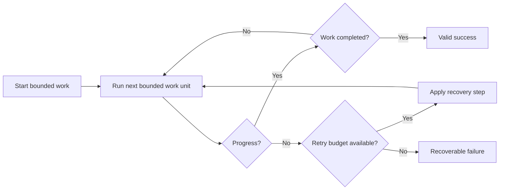

# P081 — Forward Progress With Safety

## Definition

**Forward Progress With Safety** requires bounded and visible progress toward a valid result. If
progress stops, the operation terminates in a clear recoverable state. The rule combines safety and
liveness properties.

**Aliases:** none in common use.

## Provenance

**Classification:** Athena synthesis.

Athena's operational wording is not a named theorem. Leslie Lamport's 1977 work defined the modern
difference between safety and liveness properties. Reliability practice adds deadlines, retry
budgets, cancellation, and recovery states for production workflows.

## Decision rule

For each loop, wait, retry, queue, and multistep workflow, define a progress measure and a bound.
Define the required invariants. Define a recoverable result for stopped progress.

## How to apply

- Make terminal success, failure, cancellation, and paused states distinguishable.
- Bound retries, waits, queues, and internal iteration.
- Detect and report stagnation. Do not reset a watchdog without real progress.
- Preserve invariants at every checkpoint and failure exit.
- Persist enough state to resume long work safely when required.
- Test deadlock, timeout, starvation, cancellation, and dependency-loss scenarios.

## Diagram

The workflow either makes measured progress or enters a recoverable terminal state.



## Language examples

The two examples stop after a fixed number of attempts and return a clear failure.

### Python

```python
def complete(job: Job) -> Result:
    for _ in range(3):
        result = job.try_once()
        if result.done:
            return result
    raise ProgressError("retry budget exhausted")
```

### Rust

```rust
fn complete(job: &mut Job) -> Result<Outcome, ProgressError> {
    for _ in 0..3 {
        let result = job.try_once()?;
        if result.done {
            return Ok(result);
        }
    }
    Err(ProgressError::BudgetExhausted)
}
```

## Boundaries and tensions

The principle does not require a wait-free algorithm or a short duration. Some safe work is slow or
depends on external events. It still needs visible state, cancellation, or an explicit resume state.
Safety can require a stop. A timeout is a failure result. It does not prove that a side effect did
not occur.

## Examples

**Positive:** A migration records each completed batch and enforces a time budget. It preserves
schema invariants and exits as `paused` with a resume token.

**Misuse:** A worker catches every error and retries forever. It retains a queue slot while callers
see neither completion nor failure.

**Athena/agent workflow:** A delegated task has a bounded iteration budget. It produces success,
blocked, or failed status with evidence. It does not stay active without a limit.

## Related principles

- [P039 Bounded Waiting](p039-bounded-waiting.md)
- [P040 Bounded Resources](p040-bounded-resources.md)
- [P046 Resumability](p046-resumability.md)
- [P047 Observability Is Part of Correctness](p047-observability-is-part-of-correctness.md)
- [P082 Design for Cancellation](p082-design-for-cancellation.md)

## References

### Origin/history

- [Proving the Correctness of Multiprocess Programs](https://doi.org/10.1109/TSE.1977.229904)
  is Lamport's 1977 primary work that defines safety and liveness as distinct correctness concerns.

### Current guidance

- [gRPC Deadlines](https://grpc.io/docs/guides/deadlines/) explains why calls need realistic
  deadlines and why servers must stop work after cancellation.
- [AWS Well-Architected: Control and limit retry calls](https://docs.aws.amazon.com/wellarchitected/latest/framework/rel_mitigate_interaction_failure_limit_retries.html)
  requires retry limits, backoff, and tested stop conditions.

### Further reading

- [Exponential Backoff and Jitter](https://aws.amazon.com/blogs/architecture/exponential-backoff-and-jitter/)
  shows how bounded randomized retry can preserve progress without synchronized contention.

[Back to the engineering principles catalog](../README.md#p081)
