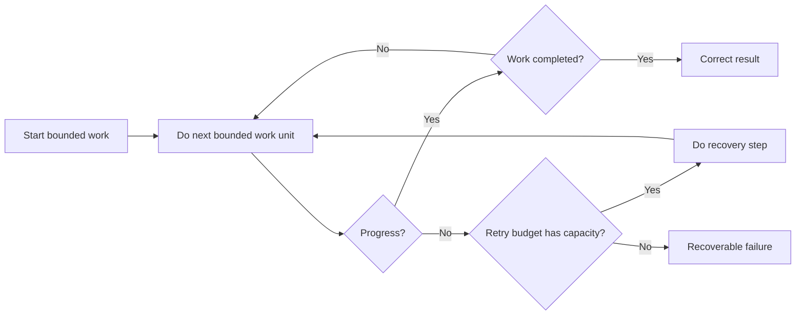

# P081 — Forward Progress With Safety

## Definition

With **Forward Progress With Safety**, an operation must have bounded and clear progress to a
correct result. If progress stops, the operation terminates in a clear recoverable state. The rule
includes safety and liveness properties.

**Aliases:** none.

## Provenance

**Classification:** Athena synthesis.

Athena gives this rule for operations. The rule is not a theorem with a specified name. Leslie Lamport's 1977
research gives the difference between safety and liveness properties. Reliability practice includes deadlines, retry
budgets, cancellation, and recovery states for production workflows.

## Decision rule

For each loop, wait, retry, queue, and multistep workflow, give a progress measure and a bound.
Record the necessary invariants. Give a recoverable result for stopped progress.

## How to apply

- Use different results for terminal success, failure, cancellation, and paused states.
- Set limits for retries, waits, queues, and internal iteration.
- Monitor progress and record each stagnation event. Do not reset a watchdog without measured progress.
- Keep invariants at all checkpoints and failure exits.
- When necessary, record sufficient state to resume long work safely.
- Do tests of deadlock, timeout, starvation, cancellation, and dependency-loss scenarios.

## Diagram

The workflow makes measured progress or has a recoverable terminal state.



## Language examples

The two examples stop after a fixed number of attempts and return a clear failure.

### Python

```python
def complete(job: Job) -> Result:
    for _ in range(3):
        result = job.try_once()
        if result.done:
            return result
    raise ProgressError("retry budget exhausted")
```

### Rust

```rust
fn complete(job: &mut Job) -> Result<Outcome, ProgressError> {
    for _ in 0..3 {
        let result = job.try_once()?;
        if result.done {
            return Ok(result);
        }
    }
    Err(ProgressError::BudgetExhausted)
}
```

## Boundaries and tensions

A wait-free algorithm and a short duration are not necessary. Some safe work is slow or
waits for external events. Clear state, cancellation, or an explicit resume state is necessary.
Safety can make the operation stop. A timeout is a failure result. The timeout does not give proof
that a side effect did not occur.

## Examples

**Positive:** A migration records each completed batch and sets a time budget. The migration keeps schema
invariants and stops with a `paused` status and resume token.

**Misuse:** A worker catches each error and retries without a limit. The worker keeps a queue slot. Callers
see no completion or failure.

**Athena/agent workflow:** A delegated task has a bounded iteration budget. The task gives success,
blocked, or failure status with evidence. The task does not stay active without a limit.

## Related principles

- [P039 Bounded Waiting](p039-bounded-waiting.md)
- [P040 Bounded Resources](p040-bounded-resources.md)
- [P046 Resumability](p046-resumability.md)
- [P047 Observability Is Part of Correctness](p047-observability-is-part-of-correctness.md)
- [P082 Design for Cancellation](p082-design-for-cancellation.md)

## References

### Source information

- [Proving the Correctness of Multiprocess Programs](https://doi.org/10.1109/TSE.1977.229904)
  is Lamport's 1977 primary paper that gives safety and liveness as different correctness concerns.

### Applicable information

- [gRPC Deadlines](https://grpc.io/docs/guides/deadlines/) gives information about call deadlines.
  Call deadlines must agree with the specified duration. Servers must stop work after cancellation.
- [AWS Well-Architected: Control and limit retry calls](https://docs.aws.amazon.com/wellarchitected/latest/framework/rel_mitigate_interaction_failure_limit_retries.html)
  gives retry limits, backoff, and tested stop conditions.

### More information

- [Exponential Backoff and Jitter](https://aws.amazon.com/blogs/architecture/exponential-backoff-and-jitter/)
  gives a bounded randomized retry method. The method decreases synchronized contention and helps
  progress.

[Back to the engineering principles catalog](../README.md#p081)
