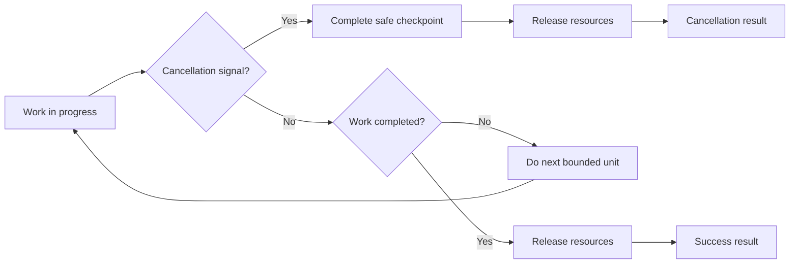

# P082 — Design for Cancellation

## Definition

With **Design for Cancellation**, an interface includes a caller's loss of interest as a terminal
signal. The designer gives the cancellation request, propagation path, cleanup, and
terminal result for long or asynchronous work. Cancellation must keep state correct and must not
cause a resource leak.

**Aliases:** none. Cooperative cancellation is one implementation method.

## Provenance

**Classification:** practitioner heuristic.

No source records an initial author. Operating systems, concurrent programs, and distributed request
interfaces use cooperative cancellation. Structured concurrency and context interfaces
make the lifetime relation between callers and child work explicit.

## Decision rule

If work can continue after the caller request stops, give the work a cancellation contract. Tell the
cancellation point. Tell the cleanup guarantee and the terminal result.

## How to apply

- Accept and propagate the host's cancellation or context capability.
- Monitor cancellation at bounded, state-safe checkpoints.
- After the cancellation signal, do not start more work.
- Release resources and join child work or record each child result. Then return.
- Use different results for cancellation, timeout, dependency failure, and completion without error.
- When signals can occur again and again, make cleanup, compensation, and retries idempotent.
- Do tests of races between cancellation, completion, and side effects that stop before completion.

## Diagram

The worker releases the worker resources after cancellation or completion.



## Language examples

The two examples monitor one cancellation signal, keep operation failures distinct, and release
resources on cancellation and completion.

### Python

```python
async def import_rows(cancel: asyncio.Event) -> None:
    try:
        for batch in batches:
            if cancel.is_set():
                raise asyncio.CancelledError
            await import_batch(batch)
    finally:
        await close_input()
```

### Rust

```rust
enum ImportError { Cancelled, Operation(Error) }

fn import_rows(cancel: &AtomicBool) -> Result<(), ImportError> {
    let _input = InputGuard::open().map_err(ImportError::Operation)?;
    for batch in batches() {
        if cancel.load(Ordering::Acquire) {
            return Err(ImportError::Cancelled);
        }
        import_batch(batch).map_err(ImportError::Operation)?;
    }
    Ok(())
}
```

## Boundaries and tensions

A cancellation request does not give proof of rollback. Before cancellation occurs, an atomic or
irreversible step can complete. Until the region has correct invariants, a small cleanup region can
ignore the signal. Record each point. Do not discard a cancellation signal and return an incorrect
success result.

## Examples

**Positive:** An import stops between committed batches, closes its input, records a resume token,
and returns a clear cancellation result.

**Misuse:** A canceled HTTP request has active database work and spawned subprocesses with no owner.

**Athena/agent workflow:** A coordinator propagates an interrupted task to the subagents. The
coordinator collects the terminal state of each subagent and records all completed side effects.

## Related principles

- [P033 State-Safe Failure Semantics](p033-state-safe-failure-semantics.md)
- [P037 Idempotency Before Retry](p037-idempotency-before-retry.md)
- [P046 Resumability](p046-resumability.md)
- [P079 Explicit Ownership and Lifetimes](p079-explicit-ownership-and-lifetimes.md)
- [P083 Irreversible Actions Last](p083-irreversible-actions-last.md)

## References

### Source information

- No one primary source gives the general pattern. Do not record one language or framework as the
  source.
- [Go Concurrency Patterns: Context](https://go.dev/blog/context) records a 2014 model that
  transmits deadlines and cancellation to request-scoped work.

### Applicable information

- [gRPC Cancellation](https://grpc.io/docs/guides/cancellation/) gives cancellation propagation.
  Applications must stop work for a canceled RPC.
- [Go: Canceling in-progress operations](https://go.dev/doc/database/cancel-operations) gives
  a cancellation and cleanup example for database calls.

### More information

- [gRPC Deadlines](https://grpc.io/docs/guides/deadlines/) gives the relation between time bounds and
  automatic cancellation. The guide gives the server application responsibility for spawned-work cleanup.

[Back to the engineering principles catalog](../README.md#p082)
