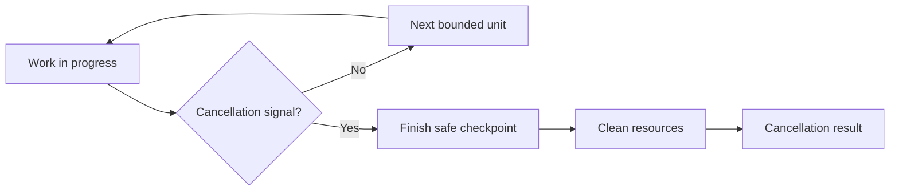

# P082 — Design for Cancellation

## Definition

**Design for Cancellation** requires the interface designer to treat a caller's loss of interest as
a terminal signal. The designer defines the cancellation request, propagation path, cleanup, and
final result for long or asynchronous work. Cancellation must not corrupt state or leak resources.

**Aliases:** none in common use. Cooperative cancellation is one implementation approach.

## Provenance

**Classification:** practitioner heuristic.

There is no verified single origin. Operating systems, concurrent programs, and distributed request
interfaces developed cooperative cancellation. Modern structured concurrency and context interfaces
make the lifetime relation between callers and child work explicit.

## Decision rule

If work can outlive the caller's need, define its cancellation contract. State where cancellation
takes effect. State the cleanup guarantee and the final result.

## How to apply

- Accept and propagate the host's cancellation or context capability.
- Check cancellation at bounded, state-safe checkpoints.
- Do not start downstream work after the cancellation signal.
- Release resources and join or account for child work. Then return.
- Distinguish cancellation from timeout, dependency failure, and successful completion.
- Make cleanup, compensation, and retries idempotent where repeated signals are possible.
- Test races between cancellation, completion, and partial side effects.

## Diagram

The worker observes cancellation at a safe checkpoint and then cleans its resources.



## Language examples

The two examples observe one cancellation signal and always perform cleanup.

### Python

```python
async def import_rows(cancel: asyncio.Event) -> None:
    try:
        for batch in batches:
            if cancel.is_set():
                raise asyncio.CancelledError
            await import_batch(batch)
    finally:
        await close_input()
```

### Rust

```rust
fn import_rows(cancel: &AtomicBool) -> Result<(), Cancelled> {
    let _input = InputGuard::open()?;
    for batch in batches() {
        if cancel.load(Ordering::Acquire) {
            return Err(Cancelled);
        }
        import_batch(batch)?;
    }
    Ok(())
}
```

## Boundaries and tensions

A cancellation request does not prove rollback. An atomic or irreversible step can finish before
cancellation takes effect. A small cleanup region can ignore the signal until it restores its
invariants. Document each such point. Do not discard a cancellation signal and return apparent
success.

## Examples

**Positive:** An import stops between committed batches, closes its input, records a resume token,
and returns a distinct cancellation result.

**Misuse:** A canceled HTTP request leaves active database work and spawned subprocesses without an
owner.

**Athena/agent workflow:** A coordinator propagates an interrupted task to its subagents, collects
their terminal states, and reports any side effects already completed.

## Related principles

- [P033 State-Safe Failure Semantics](p033-state-safe-failure-semantics.md)
- [P037 Idempotency Before Retry](p037-idempotency-before-retry.md)
- [P046 Resumability](p046-resumability.md)
- [P079 Explicit Ownership and Lifetimes](p079-explicit-ownership-and-lifetimes.md)
- [P083 Irreversible Actions Last](p083-irreversible-actions-last.md)

## References

### Origin/history

- No single primary source defines the general pattern. Do not attribute it to one language or
  framework.
- [Go Concurrency Patterns: Context](https://go.dev/blog/context) documents an influential 2014
  model that transmits deadlines and cancellation through request-scoped work.

### Current guidance

- [gRPC Cancellation](https://grpc.io/docs/guides/cancellation/) defines cancellation propagation
  and makes clear that applications must stop work they started for a canceled RPC.
- [Go: Canceling in-progress operations](https://go.dev/doc/database/cancel-operations) shows
  cancellation and cleanup across database calls.

### Further reading

- [gRPC Deadlines](https://grpc.io/docs/guides/deadlines/) connects time bounds to automatic
  cancellation. It gives the server application responsibility for spawned-work cleanup.

[Back to the engineering principles catalog](../README.md#p082)
