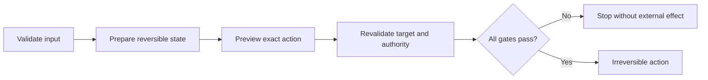

# P083 — Irreversible Actions Last

## Definition

**Irreversible Actions Last** completes validation, reversible preparation, authorization, and
evidence collection before an irreversible external effect. A multistep workflow identifies its
point of no return. It puts that point as late as practical.

**Aliases:** none in common use.

## Provenance

**Classification:** Athena synthesis.

No verified source establishes this exact wording. The rule combines change control, transaction
authorization, staged release, and rollback practice. It applies this order to software and agent
workflows.

## Decision rule

Complete all checks and reversible preparation before an irreversible step. Revalidate the
mutable target and authority immediately before the exact action.

## How to apply

- Classify steps as read-only, reversible, compensatable, or irreversible.
- Validate inputs and targets first. Then allocate or modify external state.
- Use previews, staging, backups, canaries, and dry runs when they provide real evidence.
- Bind approval and authorization to the final target and parameters.
- Recheck facts that may have changed during preparation.
- Make the commit step atomic or idempotent where possible.
- Record the outcome and any side effects that cannot be reversed.

## Diagram

The workflow completes each reversible gate before the point of no return.



## Language examples

The two examples revalidate the target immediately before publication.

### Python

```python
def publish(request: Request) -> Receipt:
    artifact = prepare(request)
    preview(artifact)
    verify_target(request.target)
    verify_authority(request.actor, request.target)
    return publisher.publish(artifact)
```

### Rust

```rust
fn publish(request: &Request) -> Result<Receipt, Error> {
    let artifact = prepare(request)?;
    preview(&artifact)?;
    verify_target(&request.target)?;
    verify_authority(&request.actor, &request.target)?;
    publisher::publish(artifact)
}
```

## Boundaries and tensions

An irreversible action can be the required result. The principle delays the action and does not
prohibit it. Long preparation can make decisions stale. Thus, the final gate checks mutable state
again.

Compensation is not true reversal. Messages, charges, deletions, and public releases can already
have external effects. Emergency paths still need their defined authorization.

## Examples

**Positive:** A release builds, tests, stages, and verifies the target revision. It receives bound
authorization. It then switches production traffic.

**Misuse:** A checkout charges a payment method first. It validates inventory and delivery details
later. It assumes a refund will erase every consequence.

**Athena/agent workflow:** An agent resolves the repository and issue body. It previews the exact
request and verifies authority. It then creates the externally visible GitHub issue.

## Related principles

- [P021 Evolutionary and Reversible Design](p021-evolutionary-and-reversible-design.md)
- [P061 Separate Decision from High-Impact Execution](p061-separate-decision-from-high-impact-execution.md)
- [P062 Human Approval for Irreversible or High-Risk Actions](p062-human-approval-for-irreversible-or-high-risk-actions.md)
- [P076 Parse, Then Validate, Then Operate](p076-parse-then-validate-then-operate.md)
- [P082 Design for Cancellation](p082-design-for-cancellation.md)

## References

### Origin/history

- No single primary source defines the general order. Athena uses a synthesis of transaction,
  change-control, and release-safety practice.

### Current guidance

- [OWASP Transaction Authorization Cheat Sheet](https://cheatsheetseries.owasp.org/cheatsheets/Transaction_Authorization_Cheat_Sheet.html)
  requires ordered state transitions and a final authorization gate tied to transaction execution.
- [Google SRE Workbook: Canarying Releases](https://sre.google/workbook/canarying-releases/)
  presents staged exposure, evaluation, and rollback as release safety mechanisms.

### Further reading

- [NIST SP 800-53 Revision 5](https://csrc.nist.gov/pubs/sp/800/53/r5/upd1/final) includes
  configuration change control, impact analysis, authorization, testing, and documentation controls
  for governed changes.

[Back to the engineering principles catalog](../README.md#p083)
