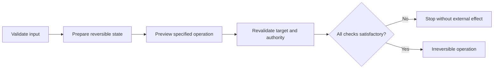

# P083 — Irreversible Actions Last

## Definition

**Irreversible Actions Last** completes validation, reversible preparation, authorization, and
evidence collection before an irreversible external effect. A multistep workflow can have more than
one irreversible step. Put each irreversible step near the end of the workflow.

**Aliases:** none.

## Provenance

**Classification:** Athena synthesis.

No source gives this text. The rule includes change control, transaction
authorization, staged release, and rollback practice. The rule uses this order for software and agent
workflows.

## Decision rule

Before an irreversible step, complete all checks and reversible preparation. Immediately before the
specified operation, revalidate the mutable target and authority.

## How to apply

- Put steps in four groups: read-only, reversible, compensatable, and irreversible.
- Validate inputs and targets first. Then make or change external state.
- With correct evidence, use previews, staging, backups, canaries, and dry runs.
- Bind approval and authorization to the publication target and parameters.
- After preparation, examine mutable facts again.
- Where possible, make the commit step atomic or idempotent.
- Record the outcome and all irreversible side effects.

## Diagram

Before the irreversible step, the workflow completes each reversible gate.



## Language examples

Immediately before publication, the two examples revalidate the artifact target.

### Python

```python
def publish(request: Request) -> Receipt:
    artifact = prepare(request)
    preview(artifact)
    verify_target(artifact.target)
    verify_authority(request.actor, artifact.target)
    return publisher.publish(artifact)
```

### Rust

```rust
fn publish(request: &Request) -> Result<Receipt, Error> {
    let artifact = prepare(request)?;
    preview(&artifact)?;
    verify_target(&artifact.target)?;
    verify_authority(&request.actor, &artifact.target)?;
    publisher::publish(artifact)
}
```

## Boundaries and tensions

An irreversible operation can be the necessary result. The principle puts validation before the
operation but does not prevent the operation. Long preparation can make decisions incorrect. The last
gate examines mutable state again.

Compensation is not a reversal. Messages, charges, deletions, and public releases can have
external effects before compensation. Specified authorization is necessary for emergency paths.

## Examples

**Positive:** A release process assembles the artifact and does tests, staging, and target-revision
verification. The release process receives bound authorization and then moves production traffic.

**Misuse:** A checkout charges a payment method first. The checkout then validates inventory and delivery
details. The workflow has the incorrect assumption that a refund removes all effects.

**Athena/agent workflow:** An agent resolves the repository and issue body. The agent previews the
specified request and does an authority verification. The agent then creates the public GitHub issue.

## Related principles

- [P021 Evolutionary and Reversible Design](p021-evolutionary-and-reversible-design.md)
- [P061 Separate Decision from High-Impact Execution](p061-separate-decision-from-high-impact-execution.md)
- [P062 Human Approval for Irreversible or High-Risk Actions](p062-human-approval-for-irreversible-or-high-risk-actions.md)
- [P076 Parse, Then Validate, Then Operate](p076-parse-then-validate-then-operate.md)
- [P082 Design for Cancellation](p082-design-for-cancellation.md)

## References

### Source information

- No one primary source gives the general order. Athena uses a synthesis of transaction,
  change-control, and release-safety practice.

### Applicable information

- [OWASP Transaction Authorization Cheat Sheet](https://cheatsheetseries.owasp.org/cheatsheets/Transaction_Authorization_Cheat_Sheet.html)
  gives ordered state transitions and an authorization gate immediately before transaction
  execution.
- [Google SRE Workbook: Canarying Releases](https://sre.google/workbook/canarying-releases/)
  gives information about staged exposure, evaluation, and rollback as release safety mechanisms.

### More information

- [NIST SP 800-53 Revision 5](https://csrc.nist.gov/pubs/sp/800/53/r5/upd1/final) includes
  configuration change control, impact analysis, authorization, testing, and documentation controls
  for changes with governance.

[Back to the engineering principles catalog](../README.md#p083)
