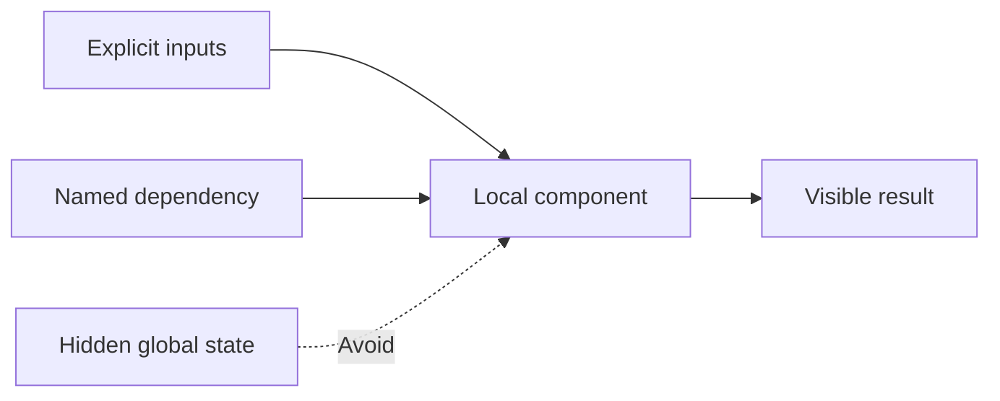

# P084 — Prefer Local Reasoning

## Definition

**Prefer Local Reasoning** makes a component clear from its contract, implementation, and nearby
collaborators. A reader does not need distant hidden state, ambient configuration, implicit control
flow, or unrelated subsystems.

**Aliases:** local reasoning and locality of reasoning.

## Provenance

**Classification:** established principle.

The exact phrase has no single verified origin. The rule uses modularity, information hiding,
structured programs, and the Law of Demeter. These practices reduce the nonlocal knowledge that a
reader needs.

## Decision rule

Make each distant correctness dependency explicit. Alternatively, move its invariant closer to the
code that enforces it. A local contract must not require whole-system knowledge.

## How to apply

- Keep invariants and the state they govern in the same module.
- Pass important dependencies explicitly through narrow interfaces.
- Limit global state, hidden callbacks, reflection, and action at a distance.
- Keep each state transition visible and close to the operation that triggers it.
- Use types and contracts to summarize facts established elsewhere.
- Provide a clear entry point above lower-level implementation detail.

## Diagram

The component receives each required fact through its local contract.



## Language examples

The two examples receive the tax rate as an explicit local dependency.

### Python

```python
def total(price: Decimal, tax_rate: Decimal) -> Decimal:
    subtotal = price
    multiplier = Decimal("1") + tax_rate
    return subtotal * multiplier
```

### Rust

```rust
fn total(price: Decimal, tax_rate: Decimal) -> Decimal {
    let subtotal = price;
    let multiplier = Decimal::ONE + tax_rate;
    subtotal * multiplier
}
```

## Boundaries and tensions

Local reasoning does not justify duplicate global policy or authoritative data. A component can use
a canonical source through an explicit interface. Authority, traces, and transactions can span
components. Their control points and effects must be visible in the architecture. Some distributed
invariants are nonlocal. Model and document them.

## Examples

**Positive:** A pricing function receives a typed pricing policy and order. The function does not
consult mutable globals, environment variables, or an implicit request-local cache.

**Misuse:** A property assignment triggers an undocumented observer in another package. The observer
mutates persistent state.

**Athena/agent workflow:** An agent grounds its decision in the task, repository instructions, and
nearby implementation. The agent does not rely on undocumented memory about another checkout.

## Related principles

- [P005 Modularity](p005-modularity.md)
- [P018 Information Hiding](p018-information-hiding.md)
- [P019 Explicit Contracts](p019-explicit-contracts.md)
- [P078 Single Source of Truth](p078-single-source-of-truth.md)
- [P085 Explicit Is Better Than Implicit](p085-explicit-is-better-than-implicit.md)

## References

### Origin/history

- [Object-Oriented Programming: An Objective Sense of Style](https://doi.org/10.1145/62084.62113)
  is the 1988 primary Law of Demeter paper. It links limited collaborator knowledge to lower coupling
  and easier correctness analysis.
- [On the Criteria To Be Used in Decomposing Systems into Modules](https://doi.org/10.1145/361598.361623)
  gives the foundational information-hiding argument for comprehensible module boundaries.

### Current guidance

- [Google Engineering Practices: What to look for in a code review](https://google.github.io/eng-practices/review/reviewer/looking-for.html)
  treats code that cannot be understood quickly by readers as excessive complexity.

### Further reading

- [Google Go Style Guide](https://google.github.io/styleguide/go/guide.html) centers clarity and
  reader context when authors select among otherwise correct implementations.

[Back to the engineering principles catalog](../README.md#p084)
