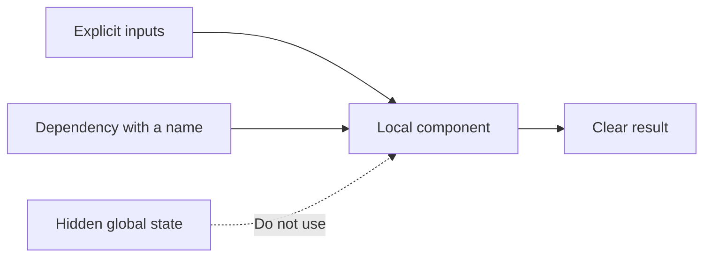

# P084 — Prefer Local Reasoning

## Definition

**Prefer Local Reasoning** makes a component clear from its contract, implementation, and local
collaborators. The component has no nonlocal hidden state, implicit configuration, or implicit
control flow. Its local contract identifies all necessary subsystem dependencies.

**Aliases:** local reasoning and locality of reasoning.

## Provenance

**Classification:** principle with source evidence.

No source records an initial author of the phrase. The rule uses modularity, information hiding,
structured programs, and the Law of Demeter. These practices decrease the nonlocal knowledge
necessary for a reader.

## Decision rule

Make each nonlocal correctness dependency explicit. When possible, move each invariant near the
enforcement code. The local contract must give sufficient information without knowledge of the full
system.

## How to apply

- Keep each invariant and the applicable state in the same module.
- Use explicit narrow interfaces to supply important dependencies.
- Use the minimum global state, hidden callbacks, reflection, and nonlocal effects.
- Keep each state transition clear and near the operation that starts the transition.
- Use types and contracts to show facts from a different component.
- Give a clear entry point for lower-level implementation detail.

## Diagram

The local contract supplies each necessary fact to the component.



## Language examples

The two examples accept ASCII-decimal cents to 1,000,000 and basis points to 10,000, with the same
errors and integer half-up rule.

### Python

```python
def parse_decimal(text: str, maximum: int, width: int) -> int:
    if not text or len(text) > width or not text.isascii() or not text.isdecimal():
        raise ValueError("invalid decimal value")
    value = int(text)
    if value > maximum:
        raise ValueError("value outside specified range")
    return value

def total_cents(price: str, rate: str) -> int:
    price_value = parse_decimal(price, 1_000_000, 7)
    rate_value = parse_decimal(rate, 10_000, 5)
    return price_value + (price_value * rate_value + 5_000) // 10_000
```

### Rust

```rust
fn total_cents(price: &str, rate: &str) -> Result<u64, &'static str> {
    let parse = |text: &str, maximum, width| -> Result<u64, &'static str> {
        if text.is_empty() || text.len() > width || !text.bytes().all(|b| b.is_ascii_digit()) {
            return Err("invalid decimal value");
        }
        let value = text.parse::<u64>().map_err(|_| "invalid decimal value")?;
        if value > maximum { return Err("value outside specified range"); }
        Ok(value)
    };
    let (price, rate) = (parse(price, 1_000_000, 7)?, parse(rate, 10_000, 5)?);
    Ok(price + (price * rate + 5_000) / 10_000)
}
```

## Boundaries and tensions

Local reasoning does not let components duplicate global policy or authoritative data. A component
can use an explicit interface to access a canonical source. Authority, traces, and transactions can
include more than one component. The architecture must show these control points and effects. Some
distributed invariants are nonlocal. Record each nonlocal invariant.

## Examples

**Positive:** A pricing function receives a typed pricing policy and order. The function does not
read mutable globals, environment variables, or an implicit request-local cache.

**Misuse:** A property assignment starts an observer that the contract does not show. The
observer in a different package mutates persistent state.

**Athena/agent workflow:** An agent uses the task, repository instructions, and
local implementation. The agent does not use memory about a different checkout without repository evidence.

## Related principles

- [P005 Modularity](p005-modularity.md)
- [P018 Information Hiding](p018-information-hiding.md)
- [P019 Explicit Contracts](p019-explicit-contracts.md)
- [P078 Single Source of Truth](p078-single-source-of-truth.md)
- [P085 Explicit Is Better Than Implicit](p085-explicit-is-better-than-implicit.md)

## References

### Source information

- [Object-Oriented Programming: An Objective Sense of Style](https://doi.org/10.1145/62084.62113)
  is the 1988 primary Law of Demeter paper. The paper gives the relation between a small quantity of
  collaborator knowledge, less coupling, and clear correctness analysis.
- [On the Criteria To Be Used in Decomposing Systems into Modules](https://doi.org/10.1145/361598.361623)
  gives the information-hiding argument for clear module boundaries.

### Applicable information

- [Google Engineering Practices: What to look for in a code review](https://google.github.io/eng-practices/review/reviewer/looking-for.html)
  gives this complexity rule. If readers cannot quickly know what code does, code has too much complexity.

### More information

- [Google Go Style Guide](https://google.github.io/styleguide/go/guide.html) uses clarity and reader
  context for the selection of correct implementations.

[Back to the engineering principles catalog](../README.md#p084)
