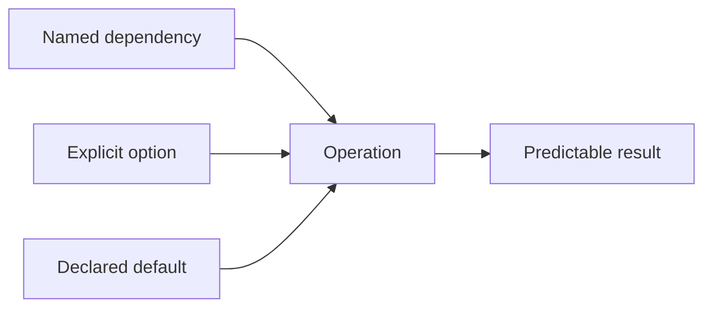

# P085 — Explicit Is Better Than Implicit

## Definition

**Explicit Is Better Than Implicit** makes important behavior visible in interfaces, types,
configuration, and nearby control flow. This behavior can affect correctness, security, or
maintenance. Dependencies, defaults, conversions, state changes, ownership, and side effects must
not depend on hidden conventions.

**Aliases:** explicitness principle and explicit over implicit.

## Provenance

**Classification:** practitioner heuristic.

Tim Peters included the exact aphorism in the Zen of Python. He first posted it to the Python
community in 1999. PEP 20 later recorded it. Similar guidance occurs in interface and language
design. Athena applies the rule to all languages.

## Decision rule

If a fact changes an operation, make that fact visible at the selection or call point.

## How to apply

- Pass dependencies and request context through documented interfaces.
- Name lossy conversions, defaults, units, and fallback behavior.
- Represent state transitions and terminal states explicitly.
- Make external writes and transaction commits visible in control flow.
- Declare configuration precedence and the source of each effective value.
- Prefer schemas and typed values over magic strings and positional conventions.

## Diagram

The call site supplies each fact that can change the result.



## Language examples

The two examples accept a local wall time and explicit source and target zones. Each example rejects
ambiguous and nonexistent source times.

### Python

```python
def convert_time(local: datetime, source: ZoneInfo, target: ZoneInfo) -> datetime:
    if local.tzinfo is not None:
        raise ValueError("expected local wall time")
    candidates = [local.replace(tzinfo=source, fold=fold) for fold in (0, 1)]
    valid = [value for value in candidates if value.astimezone(timezone.utc)
             .astimezone(source).replace(tzinfo=None) == local]
    instants = {value.astimezone(timezone.utc) for value in valid}
    if len(instants) != 1:
        raise ValueError("ambiguous or nonexistent local time")
    return instants.pop().astimezone(target)
```

### Rust

```rust
fn convert_time(local: NaiveDateTime, source: Tz, target: Tz)
    -> Result<DateTime<Tz>, &'static str> {
    match source.from_local_datetime(&local) {
        LocalResult::Single(value) => Ok(value.with_timezone(&target)),
        LocalResult::Ambiguous(_, _) => Err("ambiguous local time"),
        LocalResult::None => Err("nonexistent local time"),
    }
}
```

## Boundaries and tensions

Explicitness does not require maximum text. Stable language forms and known repository conventions
can be clearer than ceremonial wrappers. Information hiding remains useful. Expose the contract,
not each internal detail. Do not make each implementation choice public configuration. Such
configuration increases surface area and transfers complexity to users.

## Examples

**Positive:** A timestamp conversion names the source and destination time zones. It does not use
the process locale.

**Misuse:** A save method sometimes publishes an external event because unrelated middleware sets
a thread-local flag.

**Athena/agent workflow:** An agent states assumptions, validation limits, and externally visible
actions. The agent does not infer authority from repository content.

## Related principles

- [P006 Principle of Least Astonishment](p006-principle-of-least-astonishment.md)
- [P018 Information Hiding](p018-information-hiding.md)
- [P019 Explicit Contracts](p019-explicit-contracts.md)
- [P076 Parse, Then Validate, Then Operate](p076-parse-then-validate-then-operate.md)
- [P084 Prefer Local Reasoning](p084-prefer-local-reasoning.md)

## References

### Origin/history

- [PEP 20 — The Zen of Python](https://peps.python.org/pep-0020/) is the primary published source
  for the exact aphorism and records its earlier Python-list history.

### Current guidance

- [Google Go Style Guide](https://google.github.io/styleguide/go/guide.html) directs authors to
  optimize for clarity, consistency, and the reader's context rather than brevity alone.

### Further reading

- [Design by Contract](https://www.kth.se/social/files/59526bfb56be5b4f17000807/meyer-92-contracts.pdf)
  explains how explicit preconditions, postconditions, and invariants make component obligations
  visible and checkable.

[Back to the engineering principles catalog](../README.md#p085)
