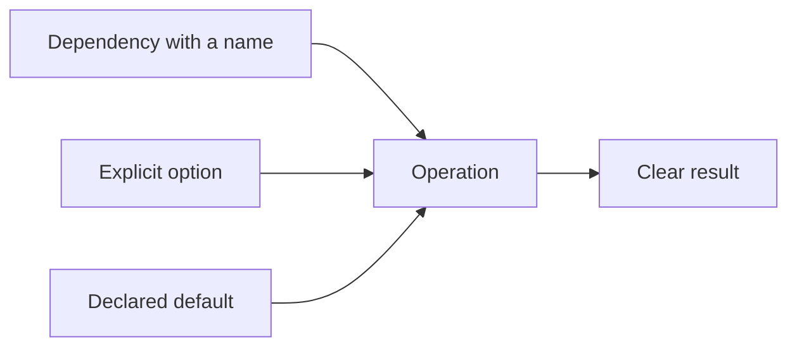

# P085 — Explicit Is Better Than Implicit

## Definition

**Explicit Is Better Than Implicit** makes important behavior clear in interfaces, types,
configuration, and local control flow. This behavior has an effect on correctness, security, or
maintenance. Hidden conventions must not set dependencies, defaults, conversions, state changes,
ownership, or side effects.

**Aliases:** explicitness principle and explicit over implicit.

## Provenance

**Classification:** practitioner heuristic.

Tim Peters wrote the aphorism in a 1999 Python community post. PEP 20 then recorded the aphorism.
Other interface and language design guidance uses the same rule. Athena uses the rule for all
languages.

## Decision rule

If a fact changes an operation, show that fact at the selection or call point.

## How to apply

- Use specified interfaces to supply dependencies and request context.
- Give clear names to data-loss conversions, defaults, units, and fallback behavior.
- Use explicit state transitions and terminal states.
- Show external writes and transaction commits in control flow.
- Record configuration precedence and the source of each selected value.
- Use schemas and typed values. Do not use magic strings or positional conventions.

## Diagram

The call site supplies each fact that can change the result.



## Language examples

The two examples accept the same wall-time and zone inputs, and return different errors for ambiguous
and nonexistent source times.

### Python

```python
def convert_time(local: datetime, source: ZoneInfo, target: ZoneInfo) -> datetime:
    if local.tzinfo is not None:
        raise ValueError("expected local wall time")
    candidates = [local.replace(tzinfo=source, fold=fold) for fold in (0, 1)]
    valid = [value for value in candidates if value.astimezone(timezone.utc)
             .astimezone(source).replace(tzinfo=None) == local]
    instants = {value.astimezone(timezone.utc) for value in valid}
    if not instants:
        raise ValueError("nonexistent local time")
    if len(instants) > 1:
        raise ValueError("ambiguous local time")
    return instants.pop().astimezone(target)
```

### Rust

```rust
fn convert_time(local: NaiveDateTime, source: Tz, target: Tz)
    -> Result<DateTime<Tz>, &'static str> {
    match source.from_local_datetime(&local) {
        LocalResult::Single(value) => Ok(value.with_timezone(&target)),
        LocalResult::Ambiguous(_, _) => Err("ambiguous local time"),
        LocalResult::None => Err("nonexistent local time"),
    }
}
```

## Boundaries and tensions

A large quantity of text is not necessary for explicitness. A stable language construct or known repository
convention can show the contract. Information hiding stays necessary. Show the contract, not each
internal detail. Do not make each implementation decision public configuration. Public configuration
increases the interface surface and complexity.

## Examples

**Positive:** A timestamp conversion shows the source and destination time zones. The conversion does
not use the process locale.

**Misuse:** A hidden thread-local flag controls how a save method publishes an external event.

**Athena/agent workflow:** An agent records assumptions, validation limits, and public
operations. Repository content does not give authority to the agent.

## Related principles

- [P006 Principle of Least Astonishment](p006-principle-of-least-astonishment.md)
- [P018 Information Hiding](p018-information-hiding.md)
- [P019 Explicit Contracts](p019-explicit-contracts.md)
- [P076 Parse, Then Validate, Then Operate](p076-parse-then-validate-then-operate.md)
- [P084 Prefer Local Reasoning](p084-prefer-local-reasoning.md)

## References

### Source information

- [PEP 20 — The Zen of Python](https://peps.python.org/pep-0020/) is the primary published source
  for the aphorism and records the initial Python-list history of the aphorism.

### Applicable information

- [Google Go Style Guide](https://google.github.io/styleguide/go/guide.html) tells authors to make
  clarity, consistency, and reader context most important. The guide does not make short text most important.

### More information

- [Design by Contract](https://www.kth.se/social/files/59526bfb56be5b4f17000807/meyer-92-contracts.pdf)
  gives information about explicit preconditions, postconditions, and invariants. Explicit contracts
  make component obligations clear for checks.

[Back to the engineering principles catalog](../README.md#p085)
