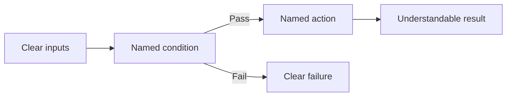

# P086 — Readability Counts

## Definition

**Readability Counts** makes code clear for the people who review, debug, operate, and change it.
Clear names, direct control flow, focused units, and clear data forms support correctness and
maintenance. They are not cosmetic features.

**Aliases:** code readability and readable-code principle.

## Provenance

**Classification:** practitioner heuristic.

The exact aphorism occurs in Tim Peters's Zen of Python, which PEP 20 records. The broader priority
is older and independent of language. Software needs many reads and changes after its first version.

## Decision rule

Among correct designs, select the one that shows its purpose, control flow, data meaning, and
failure behavior most clearly.

## How to apply

- Use domain names that communicate role and units.
- Keep functions and modules focused on coherent behavior.
- Prefer linear control flow and named intermediate results over clever compression.
- Make invariants and exceptional branches easy to locate.
- Follow established formatting and language idioms.
- Review code in its surrounding context, not only as an isolated diff.

## Diagram

The reader follows named decisions through one direct control flow.



## Language examples

The two examples use named predicates to show the eligibility rules.

### Python

```python
def is_eligible(user: User) -> bool:
    has_verified_email = user.email_verified
    is_active = user.status is Status.ACTIVE
    return has_verified_email and is_active
```

### Rust

```rust
fn is_eligible(user: &User) -> bool {
    let has_verified_email = user.email_verified;
    let is_active = user.status == Status::Active;
    has_verified_email && is_active
}
```

## Boundaries and tensions

Readability depends partly on the audience and system conventions. A verbose replacement for a
standard form can reduce readability. Do not remove useful abstractions or duplicate knowledge to
keep all code in one file. Performance, security, and interoperability can need complex code.
Isolate and test that code. Explain its nonobvious limits.

## Examples

**Positive:** Named predicates express a compound eligibility check. The predicates match the domain
rules and expose which rule failed.

**Misuse:** A dense expression saves four lines but mixes conversion, validation, mutation, and
fallback behavior in one statement.

**Athena/agent workflow:** An agent produces a focused diff and evidence summary whose intent a
reviewer can verify. The reviewer does not need the full session transcript.

## Related principles

- [P001 KISS](p001-kiss.md)
- [P006 Principle of Least Astonishment](p006-principle-of-least-astonishment.md)
- [P071 Consistency Over Personal Preference](p071-consistency-over-personal-preference.md)
- [P084 Prefer Local Reasoning](p084-prefer-local-reasoning.md)
- [P087 Comments Explain Why, Code Explains What](p087-comments-explain-why-code-explains-what.md)

## References

### Origin/history

- [PEP 20 — The Zen of Python](https://peps.python.org/pep-0020/) is the primary published source
  for the exact wording *Readability counts*.

### Current guidance

- [Google Engineering Practices: What to look for in a code review](https://google.github.io/eng-practices/review/reviewer/looking-for.html)
  evaluates naming, complexity, comments, context, and whether a reader can understand the code
  quickly.

### Further reading

- [Software Engineering at Google: Style Guides and Rules](https://abseil.io/resources/swe-book/html/ch08.html)
  explains why scalable code standards optimize for readers and consistency over individual
  preference.

[Back to the engineering principles catalog](../README.md#p086)
