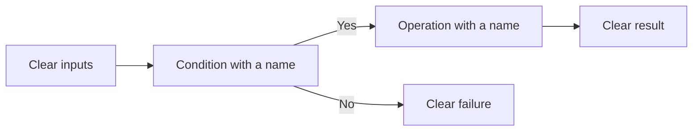

# P086 — Readability Counts

## Definition

**Readability Counts** makes code clear for the personnel who examine, debug, operate, and change it.
Clear names, linear control flow, one-function units, and clear data forms help correctness and
maintenance. Readability is a maintenance property.

**Aliases:** code readability and readable-code principle.

## Provenance

**Classification:** practitioner heuristic.

The aphorism occurs in Tim Peters's Zen of Python, which PEP 20 records. Before PEP 20, readability
was important. Readability is applicable to all languages. Personnel read and change software many
times after the first software version.

## Decision rule

For correct designs, select the design with the most clear function, control flow, data meaning, and
failure behavior.

## How to apply

- Use domain names that give role and units.
- Give each function or module one behavior.
- Use linear control flow and results with names between operations. Do not compress control flow.
- Make invariants and failure branches easy to find.
- Follow specified formatting and language idioms.
- Examine code in its local context, not only as an isolated diff.

## Diagram

The reader follows one linear control flow with decisions that have names.



## Language examples

The two examples use predicates with names that give the eligibility rules.

### Python

```python
def is_eligible(user: User) -> bool:
    has_verified_email = user.email_verified
    is_active = user.status is Status.ACTIVE
    return has_verified_email and is_active
```

### Rust

```rust
fn is_eligible(user: &User) -> bool {
    let has_verified_email = user.email_verified;
    let is_active = user.status == Status::Active;
    has_verified_email && is_active
}
```

## Boundaries and tensions

Readability changes with the audience and system conventions. A long replacement for standard code
can decrease readability. Do not remove necessary abstractions or duplicate knowledge to
keep all code in one file. Code with much complexity can be necessary for performance, security, and
interoperability. Isolate that code and do tests. Record each limit that the code does not show.

## Examples

**Positive:** Predicates with names give a compound eligibility check. The predicates contain the domain
rules and give the rule that caused the failure.

**Misuse:** A short expression removes four lines but mixes conversion, validation, mutation, and
fallback behavior in one statement.

**Athena/agent workflow:** An agent gives a diff for the task scope only and an evidence
summary. A reviewer can examine what the change does without the full session transcript.

## Related principles

- [P001 KISS](p001-kiss.md)
- [P006 Principle of Least Astonishment](p006-principle-of-least-astonishment.md)
- [P071 Consistency Over Personal Preference](p071-consistency-over-personal-preference.md)
- [P084 Prefer Local Reasoning](p084-prefer-local-reasoning.md)
- [P087 Comments Explain Why, Code Explains What](p087-comments-explain-why-code-explains-what.md)

## References

### Source information

- [PEP 20 — The Zen of Python](https://peps.python.org/pep-0020/) is the primary published source
  for the phrase *Readability counts*.

### Applicable information

- [Google Engineering Practices: What to look for in a code review](https://google.github.io/eng-practices/review/reviewer/looking-for.html)
  examines naming, complexity, comments, and context. The guidance also has a check of reader
  comprehension.

### More information

- [Software Engineering at Google: Style Guides and Rules](https://abseil.io/resources/swe-book/html/ch08.html)
  gives code standards for large projects. The standards use reader clarity and consistency, not
  one person's preference.

[Back to the engineering principles catalog](../README.md#p086)
