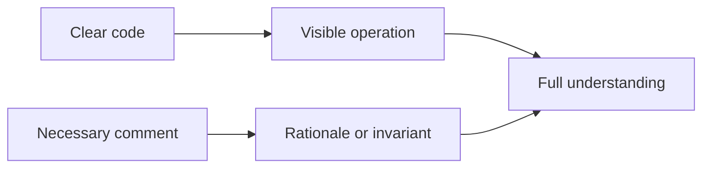

# P087 — Comments Explain Why, Code Explains What

## Definition

**Comments Explain Why, Code Explains What** uses code to show its normal operation. Comments give
rationale, limits, invariants, sources, unusual tradeoffs, or context that code cannot express.
Public interface documentation separately explains purpose, use, behavior, parameters, results, and
failures.

**Aliases:** why-comments and rationale comments.

## Provenance

**Classification:** practitioner heuristic.

No verified single origin exists for the phrase. It is a common code-review heuristic. Google's
published review guidance gives the same default and important exceptions.

## Decision rule

First, use names, structure, and types to make the code clear. Add a comment when code cannot keep
important rationale. Also document each required public contract.

## How to apply

- Explain the reason for a workaround, invariant, limit, or compatibility path.
- Link a specification, issue, or measurement when it is the source of a surprising decision.
- Document public APIs according to their language and repository contract.
- Keep comments adjacent to the behavior they constrain.
- Update or remove comments in the same change that invalidates them.
- Replace stale TODOs with owned, actionable work or delete them.

## Diagram

The code shows the action. The comment supplies rationale that the code cannot show.



## Language examples

The two examples use a comment only for the external compatibility reason.

### Python

```python
# Keep version 1 until contract ACME-42 expires in 2027.
if message.version == 1:
    return decode_legacy(message)
return decode_current(message)
```

### Rust

```rust
// Keep version 1 until contract ACME-42 expires in 2027.
match message.version {
    1 => decode_legacy(message),
    _ => decode_current(message),
}
```

## Boundaries and tensions

Complex algorithms, regular expressions, protocols, and performance code can need comments about
their steps. Clearer executable notation is not always available. Interface documentation must
describe external behavior when the implementation is clear. Comments do not justify tangled
control flow. They must not expose secrets or repeat facts that can drift.

## Examples

**Positive:** A compatibility branch cites the legacy format and explains why removal must wait for
a named migration milestone.

**Misuse:** A comment says "increment retry count" immediately above an obvious increment while the
actual retry limit remains unexplained.

**Athena/agent workflow:** A repository helper documents why it uses a one-off audit instead of a
retained prose validator. This comment preserves the policy rationale for future maintainers.

## Related principles

- [P018 Information Hiding](p018-information-hiding.md)
- [P019 Explicit Contracts](p019-explicit-contracts.md)
- [P047 Observability Is Part of Correctness](p047-observability-is-part-of-correctness.md)
- [P084 Prefer Local Reasoning](p084-prefer-local-reasoning.md)
- [P086 Readability Counts](p086-readability-counts.md)

## References

### Origin/history

- No primary source for one coinage was found. Readers must treat the phrase as a practitioner
  heuristic, not as a quotation from one author.

### Current guidance

- [Google Engineering Practices: What to look for in a code review](https://google.github.io/eng-practices/review/reviewer/looking-for.html)
  says comments usually explain why. It lists complex algorithms and regular expressions as cases
  that can benefit from an explanation of their operation.
- [Google API reference code comments](https://developers.google.com/style/api-reference-comments)
  requires public API documentation to cover purpose, use, parameters, results, and exceptions.

### Further reading

- [Google Documentation Best Practices](https://google.github.io/styleguide/docguide/best_practices.html)
  distinguishes inline comments, API documentation, READMEs, and longer conceptual documents by
  audience and purpose.

[Back to the engineering principles catalog](../README.md#p087)
