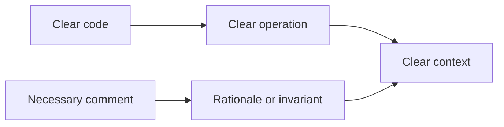

# P087 — Comments Explain Why, Code Explains What

## Definition

**Comments Explain Why, Code Explains What** uses code to show its standard operation. Comments give
rationale, limits, invariants, sources, unusual tradeoffs, or context that code cannot show.
Public interface documentation independently gives function, operation, behavior, parameters, results,
and failures.

**Aliases:** why-comments and rationale comments.

## Provenance

**Classification:** practitioner heuristic.

No source records an initial author of the phrase. The phrase is a code-review heuristic. Google's
published review guidance gives the same default and important exceptions.

## Decision rule

First, use names, structure, and types to make the code clear. When code cannot show important
rationale, add a comment. Also record each necessary public contract.

## How to apply

- Record the rationale for a workaround, invariant, limit, or compatibility path.
- When one source controls an unusual decision, refer to the applicable specification, issue, or measurement.
- Follow the language and repository contract for public API documentation.
- Keep comments adjacent to the applicable behavior.
- Change or remove comments in the same change that makes the comments incorrect.
- Delete each expired TODO or replace the TODO with specified work that has an owner.

## Diagram

The code shows the operation. The comment supplies rationale that the code cannot show.



## Language examples

The two examples use a comment only because of the external compatibility contract.

### Python

```python
def decode(message: Message) -> Payload:
    # Keep version 1 until contract ACME-42 expires in 2027.
    if message.version == 1:
        return decode_legacy(message)
    return decode_current(message)
```

### Rust

```rust
fn decode(message: &Message) -> Payload {
    // Keep version 1 until contract ACME-42 expires in 2027.
    match message.version {
        1 => decode_legacy(message),
        _ => decode_current(message),
    }
}
```

## Boundaries and tensions

Comments can be necessary for algorithms with much complexity, regular expressions, protocols, and performance
code. Comments can give information about the algorithm steps. Some rationale and algorithm meaning
cannot be clear in executable notation. When the implementation is clear, interface documentation must include external behavior.
Comments do not make control flow with much complexity correct. Comments must not show secrets or
give code facts again because the facts can change.

## Examples

**Positive:** A comment refers to the legacy format. Removal must wait for the migration milestone
with a specified name.

**Misuse:** A comment gives "increment retry count" immediately above a clear increment. The comment
does not give the specified retry limit.

**Athena/agent workflow:** A repository helper uses a comment to record why the helper sets an audit limit. The
comment keeps the policy rationale without a prose validator.

## Related principles

- [P018 Information Hiding](p018-information-hiding.md)
- [P019 Explicit Contracts](p019-explicit-contracts.md)
- [P047 Observability Is Part of Correctness](p047-observability-is-part-of-correctness.md)
- [P084 Prefer Local Reasoning](p084-prefer-local-reasoning.md)
- [P086 Readability Counts](p086-readability-counts.md)

## References

### Source information

- No primary source records one coinage. Readers must use the phrase as a practitioner
  heuristic, not as a quotation from one author.

### Applicable information

- [Google Engineering Practices: What to look for in a code review](https://google.github.io/eng-practices/review/reviewer/looking-for.html)
  gives the rule that comments usually give rationale. The guidance gives algorithms with much complexity and
  regular expressions as examples where information about the operation can help.
- [Google API reference code comments](https://developers.google.com/style/api-reference-comments)
  gives public API documentation rules. Public API documentation must include function, operation,
  parameters, results, and exceptions.

### More information

- [Google Documentation Best Practices](https://google.github.io/styleguide/docguide/best_practices.html)
  gives information about the differences between inline comments, API documentation, READMEs, and
  documents about concepts. Audience and function control the differences.

[Back to the engineering principles catalog](../README.md#p087)
