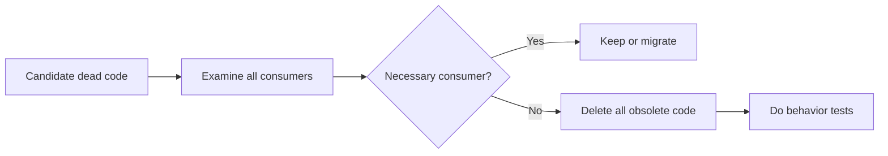

# P088 — Delete Dead Code

## Definition

**Delete Dead Code** removes code that is unreachable, superseded, commented-out, obsolete, or without a consumer. First,
do a verification that no necessary consumer or contract uses the code. Version control keeps history.
Alternatives without a consumer increase maintenance cost and inspection load.

**Aliases:** dead-code removal and obsolete-code cleanup.

## Provenance

**Classification:** practitioner heuristic.

No source records an initial author of the rule. Compilers remove dead code during optimization.
Maintainers also remove reachable source that has no product function. Athena removes code only
after an inspection finds no product function.

## Decision rule

Remove code that has no necessary consumer in runtime, build, test, migration, compatibility, or
documentation. After the removal, do tests of behavior. Do not keep a code copy without a specified
consumer.

## How to apply

- Examine direct and indirect call sites, entry points, registrations, and generated references.
- Examine reflection, dynamic loading, feature flags, serialization, and external API compatibility.
- Examine history and tests for the code rationale.
- Delete tests and documentation for the obsolete behavior only.
- Keep the removal in one specified scope.
- Do the repository's applicable static, behavioral, packaging, and integration checks.

## Diagram

After an inspection finds zero necessary consumers, the deletion starts.



## Language examples

After removal of an obsolete fallback, the two examples show the remaining path.

### Python

```python
class Command(Enum):
    SERVE = "serve"

def dispatch(command: Command) -> None:
    match command:
        case Command.SERVE:
            serve()
```

### Rust

```rust
enum Command {
    Serve,
}

fn dispatch(command: Command) {
    match command {
        Command::Serve => serve(),
    }
}
```

## Boundaries and tensions

A local inspection does not give proof that a public interface or plug-in hook has no consumer. A removal can make
deprecation and migration necessary. If historical rationale controls code at this time, the rationale is active.
Change the canonical input to remove generated source. Do not edit the generated output independently. Scope
fidelity limits cleanup to the specified scope.

## Examples

**Positive:** A maintainer removes a command with no external compatibility obligation. The
maintainer removes the handler, registration, tests, and help for the command. The maintainer then
makes the package again.

**Misuse:** A reviewer deletes a callback with no clear caller. The reviewer does not examine the
configuration name. A framework uses that name to load the callback.

**Athena/agent workflow:** An agent first does verification of manifests, references, tests, and
repository history. After this inspection, the agent removes the helper. Text inspection is not
sufficient proof.

## Related principles

- [P007 Subtraction Over Addition](p007-subtraction-over-addition.md)
- [P008 Understand Before Subtracting](p008-understand-before-subtracting.md)
- [P014 Preserve Unrequested Behavior](p014-preserve-unrequested-behavior.md)
- [P065 Verify Before Claiming Completion](p065-verify-before-claiming-completion.md)
- [P089 Delete Obsolete Configuration and Dependencies](p089-delete-obsolete-configuration-and-dependencies.md)

## References

### Source information

- No primary source records one coinage. The source-level rule changes compiler dead-code
  elimination into a maintenance rule.

### Applicable information

- [Google SRE: Operational Simplicity](https://sre.google/sre-book/simplicity/) gives usual
  dead-code removal as a practice. Code for operations must have a necessary function.
- [Google Engineering Practices: What to look for in a code review](https://google.github.io/eng-practices/review/reviewer/looking-for.html)
  gives reviewers a check of comments and TODOs in the change. A change can make comments and TODOs obsolete.

### More information

- [Google Engineering Practices: Small CLs](https://google.github.io/eng-practices/review/developer/small-cls.html)
  gives information about self-contained deletions and small changes. Small self-contained changes
  make inspection and reversal easy.

[Back to the engineering principles catalog](../README.md#p088)
