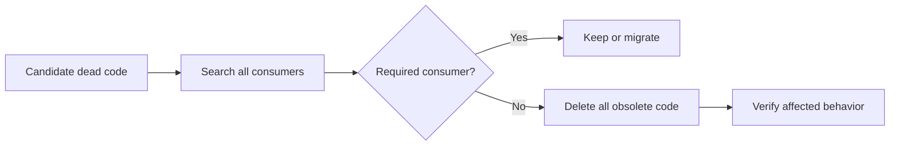

# P088 — Delete Dead Code

## Definition

**Delete Dead Code** removes unreachable, unused, superseded, commented-out, or obsolete code. First,
verify that no required consumer or contract depends on it. Version control preserves history.
Dormant alternatives increase maintenance cost and mental load.

**Aliases:** dead-code removal and obsolete-code cleanup.

## Provenance

**Classification:** practitioner heuristic.

No verified single origin exists for the rule. Compilers have long removed dead code. Maintainers
apply the broader practice to reachable source that has no product purpose. Athena requires evidence
before deletion.

## Decision rule

Remove code that has no supported consumer in runtime, build, test, migration, compatibility, or
documentation. Verify the affected behavior. Do not keep speculative backup code.

## How to apply

- Search direct and indirect call sites, entry points, registrations, and generated references.
- Check reflection, dynamic loading, feature flags, serialization, and external API compatibility.
- Inspect history and tests to understand why the code exists.
- Delete associated tests and documentation that only describe the obsolete behavior.
- Keep the removal focused and reviewable.
- Run the repository's relevant static, behavioral, packaging, and integration checks.

## Diagram

The deletion starts only after evidence shows that no required consumer remains.



## Language examples

The two examples show the supported path after removal of an obsolete fallback.

### Python

```python
HANDLERS: dict[str, Callable[[], None]] = {"serve": serve}

def dispatch(name: str) -> None:
    handler = HANDLERS[name]
    handler()
```

### Rust

```rust
enum Command {
    Serve,
}

fn dispatch(command: Command) {
    match command {
        Command::Serve => serve(),
    }
}
```

## Boundaries and tensions

A local search cannot prove that a public interface or plug-in hook is unused. A removal can require
deprecation and migration. Historical rationale is not dead when it still limits current code.
Remove generated source through its canonical input. Do not edit its output independently. Scope
fidelity still limits unrelated cleanup.

## Examples

**Positive:** A maintainer retires a command with no external compatibility obligation. The
maintainer removes its handler, registration, tests, and command-specific help, then rebuilds the
package.

**Misuse:** A reviewer deletes an apparently unused callback without a check for its configuration
name. A framework loads the callback by that name.

**Athena/agent workflow:** An agent first verifies manifests, references, tests, and repository
history. The agent removes the helper only after this review and does not use a text-search miss as
proof.

## Related principles

- [P007 Subtraction Over Addition](p007-subtraction-over-addition.md)
- [P008 Understand Before Subtracting](p008-understand-before-subtracting.md)
- [P014 Preserve Unrequested Behavior](p014-preserve-unrequested-behavior.md)
- [P065 Verify Before Claiming Completion](p065-verify-before-claiming-completion.md)
- [P089 Delete Obsolete Configuration and Dependencies](p089-delete-obsolete-configuration-and-dependencies.md)

## References

### Origin/history

- No primary source for one coinage was found. The source-level rule is best treated as a
  maintenance heuristic related to, but broader than, compiler dead-code elimination.

### Current guidance

- [Google SRE: Operational Simplicity](https://sre.google/sre-book/simplicity/) recommends routine
  dead-code removal. It requires an essential purpose for operational code.
- [Google Engineering Practices: What to look for in a code review](https://google.github.io/eng-practices/review/reviewer/looking-for.html)
  asks reviewers to examine existing comments and TODOs that a change may make obsolete.

### Further reading

- [Google Engineering Practices: Small CLs](https://google.github.io/eng-practices/review/developer/small-cls.html)
  explains why self-contained deletions and small changes are easier to review and reverse.

[Back to the engineering principles catalog](../README.md#p088)
