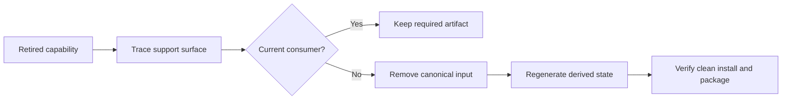

# P089 — Delete Obsolete Configuration and Dependencies

## Definition

**Delete Obsolete Configuration and Dependencies** completes a removal across its full support
surface. First, verify that no consumer remains. Then, remove obsolete flags, packages, lockfile
entries, deployment settings, tests, documents, metrics, and support code.

**Aliases:** none in common use.

## Provenance

**Classification:** Athena synthesis.

No single source establishes this exact rule. It combines dependency hygiene, configuration
control, attack-surface reduction, and operational evidence. A partial removal can leave false or
vulnerable artifacts.

## Decision rule

Complete a removal only when each support artifact has a current consumer or the canonical control
mechanism removes the artifact.

## How to apply

- Trace the removed capability through manifests, lockfiles, images, deploy files, and environment
  variables.
- Inspect optional, transitive, dynamically loaded, build-time, and platform-specific consumers.
- Remove obsolete feature flags, defaults, secrets, dashboards, alerts, and runbook steps.
- Update the canonical dependency or configuration source, then regenerate derived artifacts.
- Test clean installation, packaging, startup, supported platforms, and deployment paths.
- Review the final dependency and configuration diff for unintended upgrades or drift.

## Diagram

The removal follows every support artifact to its last verified consumer.



## Language examples

The two examples use only the current encoder after removal of the obsolete dependency.

### Python

```python
from current_encoder import encode

def export(data: Record) -> bytes:
    payload = encode(data)
    return payload
```

### Rust

```rust
use current_encoder::encode;

fn export(data: &Record) -> Vec<u8> {
    encode(data)
}
```

## Boundaries and tensions

Configuration and packages can serve external, downstream, migration, or rare platform consumers.
A local search might not show these consumers. Obey compatibility and deprecation contracts. Do not
add an unrelated dependency update to a focused cleanup. Preserve lockfile integrity and supply-chain
evidence. Never remove a quiet safety control without evidence.

## Examples

**Positive:** Removal of an obsolete exporter also removes its package, lockfile closure, feature
flag, credentials, container layer, metrics, tests, and operator documentation.

**Misuse:** Production code no longer reads a flag. Deployment templates still advertise the flag,
and each release image still contains the unused parser dependency.

**Athena/agent workflow:** An agent that removes a skill helper also verifies its package inclusion,
references, tests, and shipped documentation. The agent does not delete only the script.

## Related principles

- [P008 Understand Before Subtracting](p008-understand-before-subtracting.md)
- [P014 Preserve Unrequested Behavior](p014-preserve-unrequested-behavior.md)
- [P055 Minimize Attack Surface](p055-minimize-attack-surface.md)
- [P057 Supply-Chain Integrity](p057-supply-chain-integrity.md)
- [P078 Single Source of Truth](p078-single-source-of-truth.md)
- [P088 Delete Dead Code](p088-delete-dead-code.md)

## References

### Origin/history

- No primary source for the combined rule is established. Athena treats it as a lifecycle and
  supply-chain synthesis and does not attribute it to one author.

### Current guidance

- [OpenSSF: Simplifying Software Component Updates](https://best.openssf.org/Simplifying-Software-Component-Updates)
  explains dependency cost, the removal of unneeded components, lockfiles, and automated
  verification.
- [NIST SP 800-218, Secure Software Development Framework 1.1](https://csrc.nist.gov/pubs/sp/800/218/final)
  defines current practices that protect and maintain software components and build inputs.

### Further reading

- [CISA: Secure by Design and Default](https://www.cisa.gov/sites/default/files/2023-06/principles_approaches_for_security-by-design-default_508c.pdf)
  recommends protective mechanisms instead of unnecessary features that enlarge attack surface.
- [Google SRE: Regaining Simplicity](https://sre.google/workbook/simplicity/) discusses the removal
  of unused dependencies, configuration, and operational complexity as staffed engineering work.

[Back to the engineering principles catalog](../README.md#p089)
