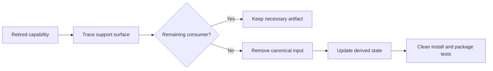

# P089 — Delete Obsolete Configuration and Dependencies

## Definition

**Delete Obsolete Configuration and Dependencies** completes a removal across its full support
surface. First, do a verification that the consumer count is zero. Then, remove obsolete flags,
packages, lockfile entries, deployment settings, tests, documents, metrics, and support code.

**Aliases:** none.

## Provenance

**Classification:** Athena synthesis.

No one source gives this rule. The rule includes dependency hygiene, configuration control,
attack-surface reduction, and evidence from operations. If the maintainer does not complete a
removal, the removal can cause incorrect artifacts or artifacts with vulnerabilities.

## Decision rule

After the workflow keeps each necessary support artifact, remove each obsolete artifact with its
canonical control. Then, complete the removal.

## How to apply

- Trace the removed capability through manifests, lockfiles, images, deploy files, and environment
  variables.
- Examine optional and build-time consumers. Examine consumers through dependency chains, platforms, and runtime loaders.
- Remove obsolete feature flags, defaults, secrets, dashboards, alerts, and runbook steps.
- Change the canonical dependency or configuration source, then make the derived artifacts again.
- Do tests of clean installation, packaging, startup, specified platforms, and deployment paths.
- Examine the dependency and configuration diff for upgrades or drift that are not in the specified change.

## Diagram

The removal follows each support artifact to the last consumer found by inspection.



## Language examples

The two examples use only the remaining encoder after removal of the obsolete dependency.

### Python

```python
from current_encoder import encode

def export(data: Record) -> bytes:
    payload = encode(data)
    return payload
```

### Rust

```rust
use current_encoder::encode;

fn export(data: &Record) -> Vec<u8> {
    encode(data)
}
```

## Boundaries and tensions

Configuration and packages can have external, migration, or platform consumers. Other systems can
also have consumers. A local inspection can give a result that does not include these consumers.

Obey compatibility and deprecation contracts. Do not add a
dependency update that is not in the specified cleanup. Keep lockfile integrity and
supply-chain evidence. A period with no alert does not give sufficient evidence to remove a safety control.

## Examples

**Positive:** Removal of an obsolete exporter also removes its package, lockfile closure, feature
flag, credentials, container layer, metrics, tests, and operator documentation.

**Misuse:** Production code no longer reads a flag. Deployment templates continue to show the
flag, and each release image contains the parser dependency with no consumer.

**Athena/agent workflow:** An agent that removes a skill helper also does verification of package
inclusion, references, tests, and shipped documentation. The agent does not delete only the script.

## Related principles

- [P008 Understand Before Subtracting](p008-understand-before-subtracting.md)
- [P014 Preserve Unrequested Behavior](p014-preserve-unrequested-behavior.md)
- [P055 Minimize Attack Surface](p055-minimize-attack-surface.md)
- [P057 Supply-Chain Integrity](p057-supply-chain-integrity.md)
- [P078 Single Source of Truth](p078-single-source-of-truth.md)
- [P088 Delete Dead Code](p088-delete-dead-code.md)

## References

### Source information

- No primary source gives this synthesis. Athena records the rule as a lifecycle and supply-chain
  synthesis and does not give one author as the source.

### Applicable information

- [OpenSSF: Simplifying Software Component Updates](https://best.openssf.org/Simplifying-Software-Component-Updates)
  gives information about dependency cost, removal of components that are not necessary, lockfiles,
  and automated verification.
- [NIST SP 800-218, Secure Software Development Framework 1.1](https://csrc.nist.gov/pubs/sp/800/218/final)
  gives applicable practices for protection and maintenance of software components and build inputs.

### More information

- [CISA: Secure by Design and Default](https://www.cisa.gov/sites/default/files/2023-06/principles_approaches_for_security-by-design-default_508c.pdf)
  tells developers to use protection mechanisms and remove features that are not necessary. Features that
  are not necessary increase the attack surface.
- [Google SRE: Regaining Simplicity](https://sre.google/workbook/simplicity/) gives information about
  removal of dependencies with no consumer, configuration, and operation complexity. Personnel have
  responsibility for this engineering work.

[Back to the engineering principles catalog](../README.md#p089)
