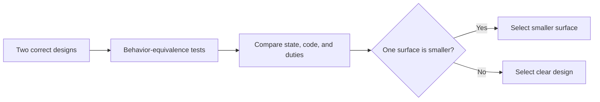

# P090 — Prefer Negative Code

## Definition

**Prefer Negative Code** selects the smaller of two implementations that have the same correct
behavior. Compare code, mutable state, configuration, dependencies, and concepts. The principle selects
a possible fault surface that is smaller, not a smaller character count.

**Aliases:** negative code and subtractive implementation.

## Provenance

**Classification:** practitioner heuristic.

Andy Hertzfeld's account about Bill Atkinson records the term. The account includes Atkinson's
"-2000" line entry after a QuickDraw change. The story gives examples of errors in a productivity measure.
The story does not give proof that line deletion makes software better. Athena uses the label for
simplification with evidence.

## Decision rule

First, make sure that behavior and necessary quality are equal. Then, select the design with a
smaller surface for maintenance and operation. Count concepts and duties, not raw lines.

## How to apply

- Remove obsolete branches, intermediaries, state, and configuration.
- Derive data from one source. Do not keep copies that authors can change independently.
- Replace custom machinery with an applicable repository mechanism.
- Replace stable duplicate behavior with one implementation. Before behavior becomes stable, do not make an abstraction.
- Compare readability, performance, security, operability, and compatibility before and after.
- Do behavioral tests and examine the completed diff.

## Diagram

After tests give equal results, compare maintenance surfaces.



## Language examples

The two examples use one status table, use the same domain for `u16` text, and reject malformed or
out-of-range input.

### Python

```python
STATUS_TEXT = ((200, "ok"), (404, "missing"), (503, "unavailable"))

def status_text(text: str) -> str:
    if not text.isascii() or not text.isdecimal():
        raise ValueError("invalid status")
    code = int(text)
    if code > 65_535:
        raise ValueError("invalid status")
    return next((label for value, label in STATUS_TEXT if value == code), "unknown")
```

### Rust

```rust
const STATUS_TEXT: &[(u16, &str)] = &[(200, "ok"), (404, "missing"), (503, "unavailable")];

fn status_text(text: &str) -> Result<&'static str, &'static str> {
    if text.is_empty() || !text.bytes().all(|byte| byte.is_ascii_digit()) {
        return Err("invalid status");
    }
    let code = text.parse::<u16>().map_err(|_| "invalid status")?;
    Ok(STATUS_TEXT.iter()
        .find_map(|(value, label)| (*value == code).then_some(*label))
        .unwrap_or("unknown"))
}
```

## Boundaries and tensions

Code golf, compressed expressions, and hidden conventions can decrease line count and increase
risk. Line counts are incorrect measures for generated code and declarative configuration. An
abstraction can remove code and add a concept with more complexity. Duplication can be safer than an incorrect
abstraction.
Keep necessary validation, diagnostics, compatibility, and explicit contracts.

## Examples

**Positive:** A data-driven transition table replaces duplicate special-case branches. The table keeps
states with names, validation, and error behavior.

**Misuse:** A developer includes some clear checks in one expression. The expression is short but
causes more inspection and diagnosis work.

**Athena/agent workflow:** After verification that the package finds the canonical documentation tree,
an agent removes a document registry with duplicate information. The agent keeps only the check that
has a product consumer.

## Related principles

- [P001 KISS](p001-kiss.md)
- [P007 Subtraction Over Addition](p007-subtraction-over-addition.md)
- [P013 AHA](p013-avoid-hasty-abstractions.md)
- [P074 Prefer Existing Mechanisms](p074-prefer-existing-mechanisms.md)
- [P086 Readability Counts](p086-readability-counts.md)
- [P088 Delete Dead Code](p088-delete-dead-code.md)

## References

### Source information

- [Folklore.org: -2000 Lines Of Code](https://www.folklore.org/Negative_2000_Lines_Of_Code.html)
  is Andy Hertzfeld's historical account of the Bill Atkinson story. The account is a historical
  anecdote, not controlled evidence for a code-quality metric.

### Applicable information

- [Google SRE: Operational Simplicity](https://sre.google/sre-book/simplicity/) gives the difference
  between necessary and accidental complexity. The guidance tells engineers to remove code with no
  business function.
- [Google SRE: Regaining Simplicity](https://sre.google/workbook/simplicity/) includes simplification
  as engineering work that decreases cognitive and operation load.

### More information

- [People systematically overlook subtractive changes](https://www.nature.com/articles/s41586-021-03380-y)
  gives experimental evidence for a general human bias for additive solutions. The study gives
  subtraction as a possible solution. The study does not give proof that line count is a software-quality
  measure.

[Back to the engineering principles catalog](../README.md#p090)
