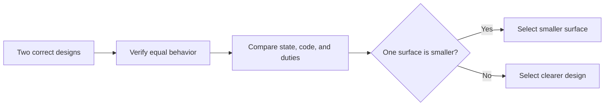

# P090 — Prefer Negative Code

## Definition

**Prefer Negative Code** selects the smaller of two implementations that have the same correct
behavior. Compare code, mutable state, configuration, dependencies, and concepts. The objective is
fewer possible faults, not fewer characters.

**Aliases:** negative code and subtractive implementation.

## Provenance

**Classification:** practitioner heuristic.

Andy Hertzfeld's account about Bill Atkinson made the term popular. Atkinson reported "-2000" lines
after a QuickDraw change. The story criticizes a poor productivity measure. It does not prove that
line deletion improves software. Athena uses the label for simplification with evidence.

## Decision rule

First, establish equal behavior and required quality. Then, select the design with the smaller
maintenance and operation surface. Count concepts and duties, not raw lines.

## How to apply

- Remove obsolete branches, intermediaries, state, and configuration.
- Derive data from one source. Do not maintain independent copies.
- Replace custom machinery with an appropriate existing mechanism.
- Consolidate observed common behavior. Do not create a premature abstraction.
- Compare readability, performance, security, operability, and compatibility before and after.
- Protect simplification with behavioral tests and final-diff verification.

## Diagram

The comparison selects less maintained surface only after it proves equal behavior.



## Language examples

The two examples replace repeated branches with one data map.

### Python

```python
STATUS_TEXT = {200: "ok", 404: "missing", 503: "unavailable"}

def status_text(code: int) -> str:
    text = STATUS_TEXT.get(code, "unknown")
    return text
```

### Rust

```rust
fn status_text(code: u16) -> &'static str {
    [(200, "ok"), (404, "missing"), (503, "unavailable")]
        .into_iter()
        .find_map(|(value, text)| (value == code).then_some(text))
        .unwrap_or("unknown")
}
```

## Boundaries and tensions

Code golf, compressed expressions, and hidden conventions can reduce lines and increase risk.
Generated code and declarative configuration make line counts especially false. An abstraction can
remove code and add a harder concept. Duplication can be safer than a wrong abstraction. Keep
required validation, diagnostics, compatibility, and explicit contracts.

## Examples

**Positive:** A data-driven transition table replaces repeated special-case branches while
it preserves named states, validation, and error behavior.

**Misuse:** A developer compresses several readable checks into a cryptic expression. The
expression is shorter but harder to review and diagnose.

**Athena/agent workflow:** An agent removes a redundant document registry after it confirms that the
package discovers the canonical documentation tree. The agent retains only the consumer-backed
check.

## Related principles

- [P001 KISS](p001-kiss.md)
- [P007 Subtraction Over Addition](p007-subtraction-over-addition.md)
- [P013 AHA](p013-avoid-hasty-abstractions.md)
- [P074 Prefer Existing Mechanisms](p074-prefer-existing-mechanisms.md)
- [P086 Readability Counts](p086-readability-counts.md)
- [P088 Delete Dead Code](p088-delete-dead-code.md)

## References

### Origin/history

- [Folklore.org: -2000 Lines Of Code](https://www.folklore.org/Negative_2000_Lines_Of_Code.html)
  is Andy Hertzfeld's retrospective account of the Bill Atkinson story. The account is a historical
  anecdote, not controlled evidence for a code-quality metric.

### Current guidance

- [Google SRE: Operational Simplicity](https://sre.google/sre-book/simplicity/) distinguishes
  essential from accidental complexity. It recommends the removal of code that does not serve
  business goals.
- [Google SRE: Regaining Simplicity](https://sre.google/workbook/simplicity/) treats simplification
  as engineering work that reduces cognitive and operational load.

### Further reading

- [People systematically overlook subtractive changes](https://www.nature.com/articles/s41586-021-03380-y)
  reports experimental evidence for a general human bias toward additive solutions. It supports
  subtraction as an option and does not support line count as a software-quality measure.

[Back to the engineering principles catalog](../README.md#p090)
