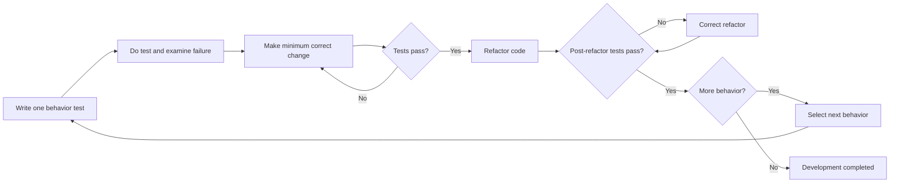

# P091 — Test-Driven Development

## Definition

**Test-Driven Development** (TDD) is a short development cycle. First, an automated test shows the
next necessary behavior and fails. Then, the author makes the minimum necessary change to
production code. The test then passes.
After all tests pass, the author refactors production code while tests continue to pass. The cycle is Red-Green-Refactor.

**Aliases:** TDD and Red-Green-Refactor cycle.

## Provenance

**Classification:** principle with source evidence.

Before 2000, Kent Beck's Extreme Programming practice included the TDD practice. His 2002
book, *Test-Driven Development: By Example*, records the practice. Athena keeps TDD because the TDD
order gives fast behavior and design feedback.

## Decision rule

For one behavior change, use one Red-Green-Refactor cycle. Make sure the test gives the expected
failure. Make the test pass with a correct production change. Then, refactor production code without
a behavior change.

## How to apply

- Record the next necessary behaviors, important failures, and boundaries.
- At a boundary where a user can see the result, write a test for one small behavior.
- Do the test and make sure that the failure shows the missing behavior.
- Write only the correct production code that is necessary to make all applicable tests pass.
- While the suite passes, refactor tests and production code.
- Do the cycle again. Then, do all necessary repository verification.

## Diagram

The cycle adds one behavior and keeps the design clear.



## Language examples

The two examples give the behavior first, use the same domain for signed `i32` text, and reject
malformed or out-of-range input.

### Python

```python
def test_clamps_negative_count() -> None:
    assert clamp_count("-1") == 0

def clamp_count(text: str) -> int:
    digits = text[1:] if text.startswith("-") else text
    if not digits or not digits.isascii() or not digits.isdecimal():
        raise ValueError("count must be i32")
    value = int(text)
    if not -(2**31) <= value <= 2**31 - 1:
        raise ValueError("count must be i32")
    return max(0, value)
```

### Rust

```rust
#[test]
fn clamps_negative_count() {
    assert_eq!(clamp_count("-1"), Ok(0));
}

fn clamp_count(text: &str) -> Result<i32, &'static str> {
    let digits = text.strip_prefix('-').unwrap_or(text);
    if digits.is_empty() || !digits.bytes().all(|byte| byte.is_ascii_digit()) {
        return Err("count must be i32");
    }
    let value = text.parse::<i32>().map_err(|_| "count must be i32")?;
    Ok(value.max(0))
}
```

## Boundaries and tensions

TDD is a development cycle, not the full test strategy. [P026 Regression Before
Repair](p026-regression-before-repair.md) is applicable only to a defect. TDD is applicable to incremental
behavior development. P022-P028 control test quality and scope.

TDD controls work order. Verification also includes builds, types, lint, integration, security, and
operation checks. A behavior-preserving refactor starts from a sufficient green baseline. Do not
make a test fail only to record an incorrect Red step.

## Examples

**Positive:** A developer writes a behavioral test for the parser's next boundary case. The test
fails because the parser does not have the behavior. A small implementation makes the test pass. The developer then removes
duplication with a green suite.

**Misuse:** A developer completes the implementation first. The developer then adds a test that
has a dependency on private call order and records the work as TDD.

**Athena/agent workflow:** For a behavior change, an agent records the expected test failure. The
agent makes the minimum correct fix and does the applicable test suite again. Then, the agent
refactors the code and does the repository verification gate. For a behavior-preserving refactor,
the agent first records the green baseline.

## Related principles

- [P022 Test Behavior, Not Implementation](p022-test-behavior-not-implementation.md)
- [P026 Regression Before Repair](p026-regression-before-repair.md)
- [P027 Deterministic and Hermetic Tests](p027-deterministic-and-hermetic-tests.md)
- [P064 Requirement-to-Test Traceability](p064-requirement-to-test-traceability.md)
- [P065 Verify Before Claiming Completion](p065-verify-before-claiming-completion.md)
- [P067 No Test Cheating](p067-no-test-cheating.md)

## References

### Source information

- [Kent Beck, *Test-Driven Development: By Example*](https://ptgmedia.pearsoncmg.com/images/9780321146533/samplepages/0321146530.pdf)
  is the publisher's sample of the book and gives the Red–Green–Refactor rules.
- [Martin Fowler: Test Driven Development](https://martinfowler.com/bliki/TestDrivenDevelopment.html)
  records the practice's Extreme Programming history and gives information about interface-design
  feedback.

### Applicable information

- [The GDS Way: Test-driven development](https://gds-way.digital.cabinet-office.gov.uk/standards/test-driven-development.html)
  gives government engineering guidance for expected-failure, green implementation, and
  Red-Green-Refactor cycles. The guidance also gives examples where other feedback mechanisms are necessary.

### More information

- [Agile Alliance: Testing in agile software development](https://agilealliance.org/agile-qa-testing-in-agile-software-development/)
  gives the differences between TDD, acceptance-test-driven practice, and behavior-driven practice.
  The three practices help continuous quality.

[Back to the engineering principles catalog](../README.md#p091)
