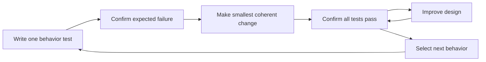

# P091 — Test-Driven Development

## Definition

**Test-Driven Development** (TDD) is a short development cycle. First, an automated test shows the
next required behavior and fails. Then, the smallest coherent production change makes the test pass.
Finally, the author improves the design while all tests pass. The cycle is Red-Green-Refactor.

**Aliases:** TDD and Red-Green-Refactor cycle.

## Provenance

**Classification:** established principle.

Kent Beck developed the modern TDD practice for Extreme Programming in the late 1990s. His 2002
book, *Test-Driven Development: By Example*, documents it. Athena keeps TDD because its order gives
fast behavior and design feedback.

## Decision rule

Use the smallest useful Red-Green-Refactor cycle for a behavior change. Confirm the expected test
failure. Make the test pass with a coherent change. Then, improve the design without a behavior
change.

## How to apply

- List the next required behaviors, their important failures, and their boundaries.
- Select one small behavior and write a test at the appropriate observable boundary.
- Run it and confirm the failure is expected and meaningful.
- Write only enough coherent production code to make all relevant tests pass.
- Improve tests and production code while the suite passes.
- Repeat, then run the repository's broader required verification.

## Diagram

The cycle adds one behavior and keeps the design clear.



## Language examples

The two examples state the behavior before they add the smallest implementation.

### Python

```python
def test_clamps_negative_count() -> None:
    assert clamp_count(-1) == 0

def clamp_count(value: int) -> int:
    return max(0, value)
```

### Rust

```rust
#[test]
fn clamps_negative_count() {
    assert_eq!(clamp_count(-1), 0);
}

fn clamp_count(value: i32) -> i32 {
    value.max(0)
}
```

## Boundaries and tensions

TDD is a development cycle, not the full test strategy. [P026 Regression Before
Repair](p026-regression-before-repair.md) applies specifically to a defect. TDD applies to incremental
behavior development. P022-P028 govern test quality and scope.

TDD governs work order. Verification also includes builds, types, lint, integration, security, and
operation checks. A pure behavior-preserving refactor starts from an adequate green baseline. Do not
create a false failure only to claim a Red step.

## Examples

**Positive:** A developer writes a behavioral test for the parser's next boundary case. The old
result makes the test fail. A narrow implementation makes it pass. The developer then removes
duplication while the suite stays green.

**Misuse:** A developer completes the implementation first. The developer then adds a brittle test
of private call order and labels the work TDD.

**Athena/agent workflow:** For a behavior change, an agent records the expected test failure. The
agent makes the minimum coherent fix and runs the focused suite again. Then, the agent improves the
design and runs the repository gate. For a pure refactor, the agent first reports the green baseline.

## Related principles

- [P022 Test Behavior, Not Implementation](p022-test-behavior-not-implementation.md)
- [P026 Regression Before Repair](p026-regression-before-repair.md)
- [P027 Deterministic and Hermetic Tests](p027-deterministic-and-hermetic-tests.md)
- [P064 Requirement-to-Test Traceability](p064-requirement-to-test-traceability.md)
- [P065 Verify Before Claiming Completion](p065-verify-before-claiming-completion.md)
- [P067 No Test Cheating](p067-no-test-cheating.md)

## References

### Origin/history

- [Kent Beck, *Test-Driven Development: By Example*](https://ptgmedia.pearsoncmg.com/images/9780321146533/samplepages/0321146530.pdf)
  is the publisher's sample of the foundational book and states the Red–Green–Refactor rules.
- [Martin Fowler: Test Driven Development](https://martinfowler.com/bliki/TestDrivenDevelopment.html)
  records the practice's Extreme Programming history and explains its interface-design feedback.

### Current guidance

- [The GDS Way: Test-driven development](https://gds-way.digital.cabinet-office.gov.uk/standards/test-driven-development.html)
  gives current government engineering guidance for expected-failure, green implementation, and
  Red-Green-Refactor cycles. It also identifies cases that need other feedback mechanisms.

### Further reading

- [Agile Alliance: Testing in agile software development](https://agilealliance.org/agile-qa-testing-in-agile-software-development/)
  distinguishes TDD from acceptance-test-driven and behavior-driven practices. It shows how all
  three practices relate to continuous quality.

[Back to the engineering principles catalog](../README.md#p091)
