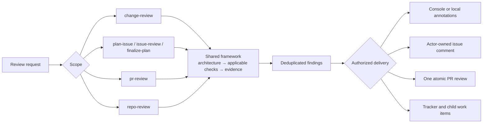

# Review framework

**Why:** Athena reviews must catch architecture and behavior regressions before lower-level checks
create false confidence. The shared framework keeps that standard consistent while each skill uses
the delivery channel appropriate to its scope. It applies the canonical
[engineering principles](../principles/README.md) through review-specific profiles instead of
redefining them.

Use the [ASD-STE100 technical-English policy](../../skills/TECHNICAL_ENGLISH.md) for all technical prose and review
output.

## System at a glance

## Components

| Component | Owns | Read when |
| --- | --- | --- |
| [ASD-STE100 technical-English policy](../../skills/TECHNICAL_ENGLISH.md) | Method for technical prose and literal-text boundary. | Before you write or change technical prose or review output. |
| [Shared contract](common.md) | Architecture gate, evidence, canonical-principle application profiles, findings, and delivery boundaries. | Every review. |
| [Language routing](language-routing.md) | Applicable language and toolchain profile. | The changed or inventoried surface contains code or build tooling. |
| [Behavior-first testing](behavior-first-testing.md) | Functional-test quality and false-confidence rules. | Tests, validation, or a plan are in scope. |
| [Issue planning](issue-planning.md) | Canonical plan identity, review, and finalized-epoch artifacts. | Planning, reviewing, or finalizing an issue. |
| [Repository scorecard](repository-scorecard.md) | Full-inventory repository criteria and scoring. | Reviewing a repository. |
| [Design-document structure](design-docs.md) | A clear order for architecture and design decisions. | Writing a new mutable design document. |

## Read order

1. Read the ASD-STE100 technical-English policy.
2. Read the shared contract and repository guidance.
3. Confirm that the artifact aligns with the architecture.
4. Classify the surface.
5. Read only the applicable language and test guidance.
6. If the scope includes issue planning, read the issue-planning contract.
7. If the scope includes a repository review, read the repository scorecard.
8. Follow the invoking skill for scope resolution and its authorized delivery channel.

The diagram appears only here. Component documents use tables or prose when those communicate their
own decision more clearly.
